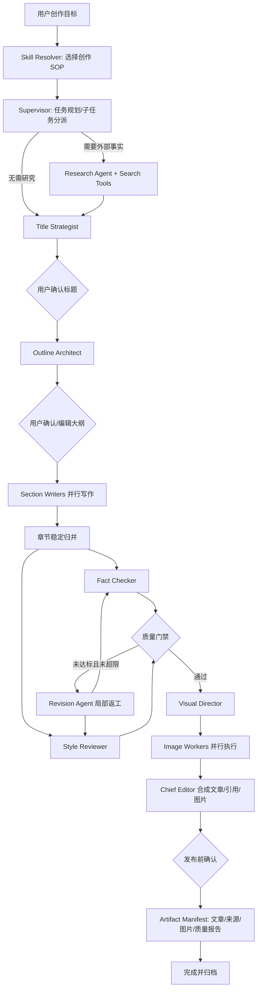

# AI Passage 多 Agent 协同创作平台改造计划

> 文档状态：Draft 2.0
> 更新日期：2026-10-05
> 项目目标：参考 DeerFlow 的 Agent Harness 思想，将当前项目从“多个 LLM 节点组成的固定流水线”升级为面向图文内容生产的混合式 Agent Workflow：以可恢复、可审计的 Workflow 负责控制，以受约束的 Agent 负责研究、创作与评审，使其具备任务规划、层级协作、Skills、受控工具、质量闭环、断点恢复、上下文治理、可验证交付和全链路观测能力，并形成可演示、可量化、适合写入简历的工程项目。

## 0. 已确认的技术决策

- 项目后端统一使用 Java 21 + Spring Boot，Go/Python 后端已由项目负责人主动删除，不需要恢复。
- Spring AI Alibaba Agent Framework / StateGraph 继续作为多 Agent 编排基础。
- 模型访问从 DashScope Starter 迁移到 Spring AI OpenAI 兼容客户端，并通过 LiteLLM 统一代理模型。
- 框架基线固定为 `Spring Boot 3.5.x + Spring AI 1.1.x`；不在本项目当前阶段升级 Spring AI 2.x，除非先完成 Spring Boot 4.x 迁移和 Spring AI Alibaba 兼容性验证。
- 当前 `spring-ai-alibaba-agent-framework:1.1.0.0-RC2` 仅作为待收口基线；优先升级到经验证的正式 `1.1.2.2` 组合必须单独实施、测试并提交，禁止与业务功能改造混合。
- 当前工作区中的 Go/Python 删除应作为一次独立的“后端技术栈收敛”变更保留；后续修改不得误恢复这些目录。
- 在开始多 Agent 架构开发前，必须先修复本地运行、Docker 部署、配置模板和文档之间的不一致，建立可验证的 Java 单后端基线。

### 0.1 混合架构边界（本轮澄清）

本项目不演进为由自由 Agent 自行决定全部流程的系统，而采用 **Workflow 控制平面 + Agent 认知执行单元** 的混合架构。

| 职责 | 归属 | 例子 | 约束 |
|---|---|---|---|
| 生命周期、状态迁移、HITL、checkpoint、取消、并发、预算上限、幂等与副作用提交 | Workflow / 普通服务 | 标题确认后才能生成大纲；同一图片节点重试复用首次结果 | 必须由代码和持久化约束保证，不能交给模型判断 |
| 开放式规划、是否需要研究、资料归纳、章节创作、质量判断、局部修改建议 | Agent | Supervisor 生成受校验计划；Research 整理来源；Reviewer 给出问题定位 | 必须使用结构化输入输出、Tool 白名单、预算和终止条件 |
| 检索、网页读取、图片下载/生成、上传、Markdown 合成、状态写入 | Tool / 领域服务 | Pexels、COS、Mermaid、数据库 | 不伪装为 Agent；统一经过 Policy 与幂等边界 |

因此，P1 已完成的 Run、checkpoint、恢复与副作用幂等是混合架构的 Workflow 底座，保持不动。P2/P3 只在这个底座内增加受限的 Agent 能力，不另建一套并行编排或允许 Supervisor 绕过状态、策略和审批边界。

### 0.2 统一状态口径（H0 基线）

各阶段历史复选框继续作为实施记录，但当前状态统一以 [Agent Harness 化改造执行计划](harness_execution_plan.md) 的状态矩阵为准：

| 阶段 | 当前状态 | 关键边界 |
|---|---|---|
| P0-A / P0-U / P0-B / P1.5 | `DONE` | 运行、框架、身份和测试基线已收口 |
| P1 | `STAGING` | Run/checkpoint/恢复/幂等已实现；完整 Supervisor/HITL 闭环仍有缺口 |
| P2 | `IN_PROGRESS` | Policy、Web Reader、来源和 Skill Registry 已实现；真实 Search Tool 与 Skill Resolver 未完成 |
| P3 | `STAGING` | 质量闭环已接入主流程但默认关闭 |
| P4 | `STAGING` | 事件、运行详情和观测 UI 已实现但默认关闭，部分交付仍缺失 |
| P5 | `DRAFT` | 工程工具已完成，正式数据和评测证据未解锁 |

后续方向按 Harness H0–H5 执行，不再用“增加 Agent 数量”作为主要进度指标。

## 1. 当前项目判断

### 1.1 已有基础

- 后端采用 Spring Boot 3、Spring AI Alibaba Agent Framework 和 StateGraph。
- 已拆分标题生成、大纲生成、正文生成、配图分析、并行配图和图文合成节点。
- 已具备 SSE 流式输出、用户选择标题/编辑大纲、图片策略降级、Agent 执行日志、MySQL/Redis、Docker 部署等能力。
- 已有完整前后端业务闭环，适合在现有工程上渐进升级，不需要推倒重写。

### 1.2 关键不足

当前项目虽然使用了“Agent”命名和 StateGraph，但从代码行为看，本质上仍偏向预定义工作流：

- 标题和大纲阶段分别只有单个节点，尚未体现 Agent 间协作。
- 正文阶段是固定的线性 DAG，缺少 Supervisor 的任务分解与动态路由。
- 各 Agent 主要执行单次 Prompt，没有统一的角色协议、能力描述、工具边界和结构化输入输出契约。
- 缺少“生成—评审—修改”的质量闭环，模型输出失败时大多直接终止。
- 每次请求重新构建和编译图，三个阶段彼此割裂，缺少可持久化的统一运行状态及断点恢复。
- 共享状态以字符串键和 `Map<String, Object>` 为主，编译期约束弱，后续扩展容易产生状态冲突。
- 当前日志能记录耗时和成功/失败，但缺少 trace、节点尝试次数、模型、Token、成本、路由原因和质量分数。
- 已有框架级契约测试（图串行/并行/流式、模型端口、Mock HTTP、流事件、Supervisor 调度）；仍缺少业务最小链路、持久化恢复、重试与 Tool 副作用的一致性测试。

因此，本次改造不以“Agent 数量更多”为目标，而以“协作机制可以被代码、测试、界面和指标证明”为标准。

### 1.3 DeerFlow 参考架构的借鉴结论

| DeerFlow 思想 | 当前项目的落地方式 | 优先级 | 取舍 |
|---|---|---:|---|
| 从聊天升级为任务执行系统 | 将一次文章创作建模为有状态 `AgentRun`，经历创建、规划、执行、审批、验证、交付、归档 | 最高 | 直接借鉴 |
| Lead Agent + 子 Agent | Supervisor 生成计划和子任务，专业 Agent 以 `parentRunId/subtaskId` 执行并由 Supervisor 验收 | 最高 | 直接借鉴 |
| Skills 封装 SOP | 建设轻量 Skill Registry，将研究、长文写作、事实核查、视觉叙事和平台改写封装为版本化能力包 | 高 | 借鉴机制，不建设插件市场 |
| 工具、策略、执行隔离 | Tool Gateway 统一做权限、预算、超时、重试和审计；仅对 Mermaid/SVG 等本地执行能力做隔离 | 高 | 按内容场景裁剪 |
| 状态、上下文、长期记忆分层 | 分离 Workflow State、Context Snapshot 和 User Preference；长上下文使用摘要压缩 | 高 | 首版不建设复杂向量记忆 |
| 可验证交付物 | 用 Artifact Manifest 统一登记文章、来源、图片、评审报告和导出文件 | 最高 | 直接借鉴 |
| 父子链路 tracing | 记录 run、subtask、node、tool、artifact 的父子关系及 Token/成本 | 高 | 直接借鉴 |
| 通用超级 Agent | 不做任意代码执行、全能助手、多渠道 IM 和开放插件市场 | 不做 | 避免偏离垂直场景 |

借鉴后的项目定位：

> **AI Passage 是一个面向图文内容生产的垂直混合式 Agent Workflow：Workflow 保障任务状态、审批、恢复和副作用一致性；Lead Agent 在受校验计划内协调专业子 Agent 与 Skills/Tools，最终交付带来源、图片、质量报告和执行轨迹的可验证文章。**

## 2. 改造目标与成功标准

### 2.1 核心目标

构建一个由 Workflow 管理生命周期和治理约束、Supervisor 在受校验边界内协调专业 Agent 的智能内容生产系统。系统能够根据用户目标自动制定创作计划，按需调用研究和配图工具，并行完成章节创作，通过评审 Agent 触发局部返工，最终输出带来源、图片和质量报告的文章。

### 2.2 可验收标准

- 一次创作由同一个 `runId/threadId` 贯穿，可暂停、恢复和回放。
- Supervisor 能根据任务复杂度至少做出“是否研究”“是否配图”“是否返工”三类条件路由。
- 至少一个真实的 fan-out/fan-in 场景：多个章节 Writer 并行生成，结果按稳定顺序归并。
- 至少一个闭环：Reviewer 评分不达标时只重写问题章节，达到阈值或重试上限后退出。
- 用户可在标题确认、大纲确认或最终发布前进行 Human-in-the-loop 审批。
- 外部研究结果保留来源 URL、标题、摘要和引用关系；无法验证的结论明确标注，而不是伪造引用。
- 节点失败支持超时、有限重试、降级或从 checkpoint 继续，避免整条任务从头执行。
- 前端可查看 Agent 拓扑、当前节点、事件时间线、质量分、Token/成本和失败原因。
- 每个子任务具有父子关系、输入契约、工具权限、预算、预期产物和验收条件，而不是无边界的 Agent 群聊。
- 最终结果以 Artifact Manifest 交付，至少包含文章 Markdown、引用来源、图片清单和质量报告。
- 长文章执行不无限堆叠完整历史消息；可通过 Context Snapshot 摘要恢复关键事实、决策和未完成事项。
- 核心图路由、状态归并、重试/恢复具备自动化测试；关键路径可在无真实 LLM Key 的情况下使用 Fake Model 验证。
- README、架构图、演示脚本和量化结果与实际实现一致，不提前宣传未完成能力。

### 2.3 非目标

- 第一阶段不建设通用 Agent 平台或可视化拖拽编排器。
- 不为了“多 Agent”让每个简单函数都调用一次 LLM；确定性操作继续使用普通服务或 Tool。
- 不在首版引入复杂的长期人格记忆、向量数据库集群或消息中间件，除非压测证明有必要。
- 不建设 DeerFlow 式通用沙箱集群、分布式 Worker 租约、IM 多渠道接入、插件市场或任意 Shell 执行能力。
- 不恢复已删除的 Go/Python 后端；以当前 Spring Boot 实现为唯一演进主线。

## 3. 目标架构

### 3.1 Agent 角色

| Agent | 主要职责 | 是否调用 LLM | 主要产物 |
|---|---|---:|---|
| Supervisor Agent | 理解目标、生成执行计划、选择后续节点、控制预算与终止条件 | 是 | `ExecutionPlan`、路由决策 |
| Research Agent | 调用搜索/网页读取工具，提取事实并整理可追溯资料 | 是 + Tools | `ResearchBundle`、引用来源 |
| Title Strategist Agent | 基于受众、平台和资料生成差异化标题候选 | 是 | `TitleCandidate[]` |
| Outline Architect Agent | 将目标和资料组织为章节计划，声明每章写作要求和证据需求 | 是 | `ArticleOutline` |
| Section Writer Agent | 按章节任务并行写作，不同实例共享统一契约 | 是 | `SectionDraft` |
| Fact Checker Agent | 检查事实是否被来源支持，标记高风险或无依据内容 | 是/规则 + Tools | `FactCheckReport` |
| Style Reviewer Agent | 按结构、连贯性、风格、可读性等维度评分并给出修改指令 | 是 | `ReviewReport` |
| Revision Agent | 仅重写未达标章节，保留已通过内容 | 是 | 修订后的 `SectionDraft` |
| Visual Director Agent | 判断哪些章节需要何种视觉素材，生成结构化配图任务 | 是 | `VisualPlan` |
| Image Worker | 并发执行 Pexels、Mermaid、Iconify、AI 生图等确定性工具 | 否/按策略 | `ImageResult[]` |
| Chief Editor Agent | 统一术语、去重、组织引用，并输出最终 Markdown | 是 + 规则 | `FinalArticle` |

说明：Agent 是有目标、状态、决策或评审能力的 LLM 角色；图片下载、上传、Markdown 替换等确定性能力定义为 Tool/Service，避免概念注水。图中的审批、恢复、取消、幂等、副作用提交和预算硬上限均由 Workflow/服务层执行，Agent 只能提出计划或决策建议，不能直接绕过这些边界。

Supervisor 不直接承担所有业务细节。它输出结构化 `ExecutionPlan` 和 `SubTaskSpec[]`；Scheduler 根据依赖关系、预算和并发上限调度子任务；每次子 Agent 执行都生成独立的 `childRunId` 并关联主任务，最终由 Supervisor 根据验收条件决定返工或交付。

### 3.2 协作流程



### 3.3 分层设计

建议按当前改动规模采用以下包结构，不额外拆微服务：

```text
agent/
├── api/             # Agent 接口、上下文、结构化结果、错误模型
├── role/            # Supervisor、Research、Writer、Reviewer 等角色实现
├── graph/           # 主图定义、条件路由、fan-out/fan-in、checkpoint
├── scheduler/       # 子任务依赖、父子 Run、并发和预算调度
├── state/           # Typed WorkflowState、Reducer、状态校验
├── llm/             # 项目自有 AI Model Port、Spring AI Adapter、Fake 实现
├── skill/           # Skill 定义、版本、输入输出 Schema、模板和注册表
├── tool/            # Search、WebReader、图片、存储等 Tool 适配器
├── policy/          # Tool 白名单、审批、预算和风险策略
├── context/         # 上下文选择、摘要压缩和 Context Snapshot
├── memory/          # 用户偏好等选择性长期记忆
├── artifact/        # 文章、来源、图片、评审报告和导出文件清单
├── event/           # 统一事件模型及 SSE 发布
├── observability/   # Trace、Token、成本、质量指标
└── evaluation/      # 质量量表、离线评测集与结果
```

现有 `service/` 继续承载用户、文章、支付、配额、对象存储等领域服务；Agent 层通过窄接口调用业务能力，避免 Agent 直接操作 Mapper。

## 4. 核心技术设计

### 4.1 统一状态与 Agent 契约

- 建立强类型 `WorkflowState`，至少包含 `runId`、`userGoal`、`executionPlan`、`researchBundle`、`selectedTitle`、`outline`、`sectionTasks`、`drafts`、`reviews`、`revisionCount`、`visualPlan`、`images`、`finalArticle`、`budget` 和 `status`。
- 所有跨节点结果使用 DTO/record 和结构化输出，不直接把自由文本 JSON 传给下游。
- 为列表追加、Map 合并、版本替换分别定义 Reducer，解决并行节点更新共享状态的冲突问题。
- 定义统一 `AgentRole<I, O>` 或等价契约，包含名称、能力说明、输入/输出类型、超时、重试策略和允许使用的 Tools。
- Prompt 从散落常量改为按角色管理的模板，并记录 `promptVersion`，便于回归测试与对比。

### 4.2 单一可恢复 StateGraph

- 将当前三个临时图整合为一个长生命周期创作图，应用启动时完成构建/编译并以 Bean 复用。
- 使用条件边表达 Supervisor 路由和质量门禁；固定业务规则优先由代码判断，只有开放性规划才交给 LLM。
- 标题、大纲、发布前确认设置 interrupt/checkpoint；恢复时根据 `runId` 从上一个状态继续。
- Checkpoint 首版可使用 MySQL 持久化正文状态、Redis 保存热状态/幂等锁；保持存储接口可替换。
- 每个节点设计幂等键 `runId + nodeId + stateVersion`，防止网络重试导致重复生图、重复上传或重复扣配额。

### 4.3 并行协作与质量闭环

- Outline 生成结构化 `SectionTask`，StateGraph 根据章节动态 fan-out 多个 Writer 节点。
- 限制单任务和全局并发数，避免章节过多时击穿模型限流；归并时按 `sectionIndex` 排序而非完成顺序。
- Fact Checker 与 Style Reviewer 可并行，使用同一版本的 Draft，随后由 Quality Gate 汇总。
- 质量评分建议包括事实支持度、结构完整度、风格一致性、可读性、重复度五项，并保存各维度分值和理由。
- 仅将失败章节交给 Revision Agent；默认最多两轮，超过上限则输出带告警的最佳版本，防止无限循环。
- 引入文章版本号和 `parentVersion`，前端可对比修改前后内容，展示“哪个 Agent 因为什么改了什么”。

### 4.4 Tool 使用与可信引用

- Research Agent 通过统一 Tool Registry 使用搜索和网页读取能力，不在 Agent 内直接耦合第三方 SDK。
- `SourceDocument` 保存 URL、页面标题、抓取时间、摘要、可引用片段和内容哈希。
- 章节草稿用引用 ID 关联来源，Chief Editor 最终转换为脚注或参考资料列表。
- 对来源超时、不可访问、内容冲突分别定义降级规则；搜索失败时允许继续创作，但必须标记“未进行事实增强”。
- Prompt 注入防护：网页内容仅作为不可信资料，禁止其改变系统指令或调用越权 Tool。
- 图片能力沿用现有策略模式，但加入超时、重试、熔断、并发限制和来源记录。

### 4.5 可观测性与成本治理

- 定义统一 `AgentEvent`：`RUN_STARTED`、`NODE_STARTED`、`MODEL_STREAMING`、`TOOL_CALLED`、`NODE_RETRYING`、`REVIEW_COMPLETED`、`HITL_REQUIRED`、`NODE_COMPLETED`、`RUN_FAILED`、`RUN_COMPLETED`。
- 事件至少携带 `runId`、`traceId`、`nodeId`、`agentName`、`attempt`、`timestamp` 和安全过滤后的 payload。
- 扩展现有 `agent_log` 或新增 run/node/tool 表，记录模型名、Prompt 版本、输入/输出 Token、首 Token 延迟、总耗时、估算成本、质量分和错误类型。
- SSE 断线重连支持 `Last-Event-ID` 和历史事件补发，避免刷新页面后进度丢失。
- 配置单任务 Token/成本/耗时预算；Supervisor 超出预算时减少研究深度、停止返工或采用轻量模型。
- 管理端展示执行瀑布图、Agent 成功率、P50/P95 延迟、平均成本、返工率和质量趋势。

### 4.6 安全与可靠性

- Tool 采用 allowlist 和最小权限；研究 Agent 不能访问支付、用户管理等业务服务。
- Prompt、网页正文、模型输出和错误日志中的密钥/用户隐私需脱敏，禁止将完整敏感输入写入日志。
- 所有 LLM 调用设置超时、指数退避和可识别错误分类；只对瞬时错误重试。
- 外部写操作使用幂等机制和补偿逻辑；生图失败可降级，事实检查失败不得伪装为已通过。
- 对并发章节数、单篇来源数、正文长度、图片数和返工轮数设置硬上限。

### 4.7 轻量 Skills 机制

借鉴 DeerFlow 的 Skills 思想，但实现为适合 Spring Boot 单体项目的轻量能力注册表，而不是运行时插件市场。

每个 Skill 至少声明：

```text
skillId / version / description
inputSchema / outputSchema
instructionTemplate / qualityRubric
allowedAgents / allowedTools
defaultBudget / timeout / maxRetries
artifactTypes / acceptanceCriteria
```

首批 Skills：

| Skill | 解决的问题 | 复用现有能力 |
|---|---|---|
| `topic-research` | 搜索、筛选、去重并形成可引用资料包 | Research Agent、Search/Web Reader Tools |
| `longform-article` | 从标题、大纲到章节并行写作和主编合成 | Title、Outline、Writer、Chief Editor |
| `fact-check` | 核验事实、引用覆盖率与高风险表达 | Fact Checker、来源模型 |
| `visual-storytelling` | 分析视觉需求并选择合适图片策略 | 现有 Image Analyzer 和图片策略 |
| `platform-adaptation` | 将成稿改写为公众号、博客等不同发布版本 | Revision/Editor Agent |

- Skill 定义存放在版本控制内，由 Java Registry 在启动时加载和校验。
- Skill 只描述业务 SOP、契约和权限，不允许绕过 StateGraph、Policy 或 Tool Gateway。
- Skill 的 Prompt/量表变更必须提升版本并进入离线回归评测，保证结果可追踪。
- MVP 仅提供内置 Skills；不支持用户上传任意代码、在线安装或热执行第三方 Skill。

### 4.8 上下文、记忆与压缩

明确区分三类数据：

| 类型 | 当前项目内容 | 生命周期 |
|---|---|---|
| Workflow State | 执行计划、子任务状态、审批点、文章版本、预算 | 随任务持久化，可恢复 |
| Context Snapshot | 当前摘要、已确认事实、引用索引、术语表、未完成事项 | 随节点/阶段生成，可替换 |
| Long-term Preference | 用户偏好风格、目标平台、常用图片方式 | 用户明确授权后选择性保存 |

- Context Manager 根据 Agent 和 Skill 选择最小必要上下文，不把所有历史消息广播给所有子 Agent。
- 章节 Writer 只接收全局写作规范、本章节任务、相关资料和术语表，降低 Token 成本与串扰。
- 在研究结束、用户确认大纲、评审返工前生成 `ContextSnapshot`；checkpoint 引用快照版本。
- 摘要压缩必须保留事实、来源 ID、用户决定、约束、未完成项和 Artifact 引用，禁止只保留泛化自然语言总结。
- 首版长期记忆只保存明确偏好，不自动从所有对话提炼用户画像。

### 4.9 Policy、执行隔离与可验证交付

- Tool Gateway 的调用顺序固定为：`Agent 决策 → Schema 校验 → Policy/预算校验 → Tool 执行 → 结果校验 → 审计事件`。
- Policy 根据 Agent、Skill、用户等级、任务预算和风险级别决定允许、拒绝或请求人工审批。
- 搜索、网页读取、图片检索为只读/低风险 Tool；付费生图、覆盖已有文章、发布内容等动作需要显式策略或审批。
- Mermaid CLI、SVG 渲染等涉及本地进程/文件的能力使用受限工作目录、固定命令模板、超时、文件大小限制和清理机制；当前不引入通用 Shell 沙箱。
- 建立 `ArtifactManifest`，登记 `artifactId`、类型、版本、URI、内容哈希、生成 Agent、来源 Run、验证状态和创建时间。
- 最终完成条件不是“模型返回成功”，而是必需 Artifact 已生成、校验通过且 Reviewer/Supervisor 满足验收规则。

### 4.10 Spring AI / Agent Framework 隔离与版本治理

当前技术选型与主流 Java AI 应用一致：Spring Boot 3.5.x 使用 Spring AI 1.1.x，Spring AI Alibaba 在其上提供 Graph/Agent 编排。但 AI 框架仍在快速演进，项目必须主动隔离框架 API，而不是让业务 Agent 直接依赖具体实现。

| 层级 | 当前状态 | 治理策略 |
|---|---|---|
| Spring Boot | `3.5.9` | 保持 `3.5.x`，不为追逐 AI 功能提前迁移 Boot 4 |
| Spring AI | `1.1.0` | 固定 `1.1.x` 支持线；使用经验证的补丁版本，不直接升级到 2.x |
| Spring AI Alibaba | `1.1.0.0-RC2` Agent Framework | 作为最高升级风险；优先验证官方修复版 `1.1.2.2`（不使用已知有回归的 `1.1.2.1`），通过后冻结 |
| 模型访问 | 业务代码直接注入 `OpenAiChatModel` | 改为依赖项目自有 `AiModelPort`，Adapter 内部才使用 Spring AI `ChatModel/ChatClient` |
| 图编排 | 业务编排器直接使用 `StateGraph`/`OverAllState` | 将框架类型限制在 `agent/graph` 适配层，Agent Role 与 Service 只依赖自有 State/DTO |
| 模型供应商 | 通过 LiteLLM 的 OpenAI 兼容接口调用 | 保持统一入口；切换模型/供应商只修改 Adapter 和配置，不修改 Agent 业务逻辑 |

`AiModelPort` 首版只需覆盖当前实际需要的能力：

```text
generate(GenerationRequest) -> GenerationResult
stream(StreamRequest) -> Flux<GenerationDelta>
generateStructured(StructuredRequest<T>) -> T
```

- `SpringAiModelAdapter` 负责 `Prompt`、`ChatResponse`、流式响应、Token 用量和框架异常到项目 DTO 的转换。
- Agent、Skill、Reviewer 和图片服务禁止直接注入 `OpenAiChatModel`、`ChatClient` 或供应商专属 Options。
- `FakeAiModelPort` 用于图、路由和回归测试；测试不依赖 LiteLLM、真实 Key 或不稳定模型输出。
- `StateGraph`、`CompiledGraph`、`OverAllState` 等类型只允许出现在 `agent/graph` 包；对外暴露 `WorkflowRunner`/`RunResult` 等自有接口。
- 维护 `framework-compatibility.md` 或等价 README 小节，记录已验证的 Boot、Spring AI、Spring AI Alibaba、JDK、LiteLLM 与模型版本矩阵。
- 每次依赖升级必须独立 PR/提交，包含升级说明、`mvn test`、Graph 契约测试、普通/流式 LLM 冒烟测试、Tool 调用测试及回滚版本；禁止“顺手升级”。

## 5. 分阶段实施计划

### P0-A：Java 单后端与 LiteLLM 基线修复（优先级：阻断）

目标：先完成已审查未提交变更的收口，保证 Java 本地开发和 Docker 部署都能使用同一套 LiteLLM 配置稳定运行。

**状态（2026-08-27）：已完成。** Java 21 Enforcer、LiteLLM 普通/流式冒烟、Docker 镜像构建和 Compose 健康检查均已通过。仍应在具备认证会话时补一次标题生成至流式正文的接口级回归；该项不阻塞后续架构开发。

#### 任务 1：确认 Java 单后端边界

- [x] 保留 `go-backend/` 与 `python-backend/` 的删除，不恢复任何代码。
- [x] 检查根目录 Dockerfile、Compose、启动脚本、CI 和 README，确保没有继续引用已删除后端。
- [x] 将“项目只维护 Java 后端”写入 README 的技术架构与目录结构说明。
- [x] 将大规模目录删除与 LiteLLM 迁移拆为边界清晰、便于审查的提交；除非用户另有要求，不把后续多 Agent 功能混入同一提交。

#### 任务 2：统一 LiteLLM 配置

- [x] 将 `application-local.yml.example` 从 DashScope 配置改为 `spring.ai.openai`，使用 `LITELLM_BASE_URL`、`LITELLM_API_KEY` 和 `LITELLM_MODEL`。
- [x] 保持 `application-prod.yml`、`docker-compose.yml` 和本地模板的属性层级、变量名及默认值一致。
- [x] 更新 `.env.example`，移除已废弃的 `DASHSCOPE_API_KEY`，增加三项 LiteLLM 配置及注释。
- [x] 更新 `start.sh`：校验 LiteLLM 配置，不再阻止未设置 DashScope Key 的用户启动。
- [x] 更新 README 的技术栈、API Key、快速开始、Docker 部署和环境变量表，删除 DashScope Starter 的旧说明。
- [x] 全仓搜索 `DASHSCOPE`、`dashscope` 和 `DashScopeChatModel`，除迁移说明外不得残留运行时引用。

#### 任务 3：修复 Docker 跨平台访问

- [x] 为 Linux Docker Engine 配置 `host.docker.internal:host-gateway` 映射，保证后端容器可以访问宿主机 LiteLLM。
- [x] 允许用户通过 `LITELLM_BASE_URL` 覆盖为远程代理地址；不得把宿主机地址写死在 Java 代码中。
- [x] 在 README 区分 Docker Desktop 与 Linux Docker Engine 的网络行为和排障方式。
- [x] 使用 `docker compose config --quiet` 验证 Compose 结构，并在 Linux/等价环境验证容器内能解析并访问 LiteLLM。

#### 任务 4：恢复可重复验证链路

- [x] 明确 JDK 21 为构建前置条件；增加版本检查或 Maven Enforcer，避免使用 JDK 17 时到编译阶段才失败。
- [x] 使用 JDK 21 执行 `mvn test`，确认 OpenAI Starter 与 Spring AI Alibaba Agent Framework 的依赖解析及代码编译正常。
- [x] 增加不访问真实模型的 Spring Context 测试，验证 `OpenAiChatModel` Bean 能正确装配。
- [x] 将验证拆为两类：CI 只运行无真实 Key、无公网依赖的 Fake Model / Mock HTTP / Testcontainers 测试；LiteLLM 冒烟测试作为可显式触发的集成验证，检查代理可达、模型名有效、普通调用和流式调用均成功。
- [ ] 执行 Docker 镜像构建和 Compose 启动，验证 `/api/health/`、一次标题生成及一次流式正文生成（Docker 健康检查已通过；认证接口级回归待补）。
- [x] 新建或更新 `development_log.md`，记录 Java 单后端收敛、模型接入迁移、验证环境和结果。

#### 任务 5：框架版本基线与升级预案

- [ ] 在 README 或架构文档维护 JDK、Spring Boot、Spring AI、Spring AI Alibaba、LiteLLM 和已验证模型提供方的版本矩阵。
- [ ] 固定 `Spring Boot 3.5.x + Spring AI 1.1.x` 为当前兼容基线；本轮不将 Spring AI 2.x 升级混入功能开发。
- [ ] 单独评估 Spring AI Alibaba 从 `1.1.0.0-RC2` 迁移到 `1.1.2.2`，并将 Spring AI 对齐到 `1.1.2`：先阅读发行说明、解析依赖树并完成契约测试，再决定是否升级；不采用官方已标记为存在回归的 `1.1.2.1`。
- [ ] 升级验证必须覆盖 Supervisor/Routing 并行子 Agent、Skills 渐进加载、并行条件边及 `allOf`/`anyOf` 聚合、异步 Tool、`returnDirect` 和 `streamMessages`；不能只以 Maven 编译通过作为结论。
- [ ] 每次框架升级使用可回滚的独立提交，不与 Agent 业务功能或配置改动混合。

#### P0-A 验收标准

- [ ] 新开发者仅依据 `.env.example` 和 README 即可启动 Java 后端，不需要猜测旧的 DashScope 配置。
- [ ] `start.sh`、Compose、本地模板和生产配置全部使用相同的 `LITELLM_*` 变量。
- [ ] Windows/macOS Docker Desktop 与 Linux Docker Engine 都有明确、可工作的 LiteLLM 连接方案。
- [ ] JDK 21 下 `mvn test` 通过，Docker 镜像构建成功，Compose 健康检查通过。
- [ ] 至少一次真实 LiteLLM 非流式调用和一次流式调用成功，结果记录在开发日志中。
- [ ] 仓库运行时文件不再引用 DashScope，Go/Python 后端目录保持删除状态。
- [ ] 版本矩阵和升级验收记录可追溯；框架升级具有独立验证和回滚边界。

### P0-U：框架升级最小验证（P0-A 后、P0-B 前）

目标：确认 `Spring AI Alibaba 1.1.2.2 + Spring AI 1.1.2` 可作为当前 Java / LiteLLM 的开发基线。版本冻结只验证已经使用或将立即使用的 API 边界；Skill、Policy Gateway 和完整 checkpoint 属于 P1/P2 业务交付，不作为冻结的前置条件。

**结论（2026-08-27）：冻结 `Spring AI Alibaba 1.1.2.2 + Spring AI 1.1.2` 作为 P0-B 的开发基线。** 已通过依赖树、Java 21、真实 LiteLLM 普通/流式冒烟、StateGraph 串行/并行/流式契约、`AiModelPort`、OpenAI Mock HTTP、内部流事件 DTO、Supervisor 路由/受限并发 Fixture、三阶段 Fake Model 业务回归、图片部分失败稳定归并，以及 MemorySaver checkpoint/interruption-resume 隔离样例。

完整持久化、幂等、取消传播和“Tool 已执行但 checkpoint 未提交”一致性仍在 P1 验收；外部 Tool 的超时、重试、预算和审计由 P2 Policy Gateway 统一实现，不能由当前并行图片节点的局部实现替代。

### P0-B：Agent 基线整理与可验证骨架（优先级：最高）

目标：先解决架构边界、状态契约和测试基础，让后续能力可持续演进。

P0-B 的执行顺序、验收、回滚与阶段门禁见 `p0-b_execution_plan.md`。P1 的独立可执行文档已创建并校验，后续严格按 `p1_execution_plan.md` 的 E1–E5 顺序执行。

- [x] 记录当前主链路的本地可比较基线：`WorkflowMetricsCollector` 在固定 Fake 三阶段工作流中采集阶段耗时、模型调用次数、结果状态和失败码；该数据不代表线上性能。
- [ ] 以已确认的 Spring Boot 单后端作为开发基线，不恢复或维护 Go/Python 实现。
- [x] 新建框架无关的 typed `WorkflowState` 与 `WorkflowStateReducer`，覆盖文章输入、草稿和交付物的不可变状态转换。
- [x] 新建项目自有 `WorkflowRunner` API 与 `ArticleWorkflowRunner` 过渡实现，调用方不再接触 `StateGraph` 类型，并保留标题/大纲审批边界。
- [x] 补齐项目自有结果 DTO 与错误模型：`WorkflowExecutionResult` 标明完成阶段，`WorkflowError` / `WorkflowExecutionException` 提供可持久化、可分类的失败信息，不泄漏框架异常类型。
- [x] 将现有 StateGraph 的字符串状态键集中到 `ArticleWorkflowKeys` 过渡边界；统一图完成后移除该 `Map<String, Object>` 适配层。
- [x] 建立框架无关的 `AgentRun` 身份与状态机契约，明确 root/parent 关系、审批/暂停和终态不可回退规则。
- [x] 建立 `AgentSubtask`、`ContextSnapshot` 和 `ArtifactManifest` 核心契约，并将其与 `AgentRun` 关联；后续将其持久化并接入 Supervisor/交付流程。
- [x] 新增 `agent_run` 持久化表和根 Run 创建服务；文章任务创建与根 Run 创建位于同一事务，既有 `article` / `agent_log` 表保持不变。
- [x] 将现有三阶段 `StateGraph` 在 Spring Bean 初始化期编译并复用；无 Spring 的契约测试通过线程安全懒加载保持可运行。
- [x] 在编排器启用路径下，将现有标题—大纲—正文—配图阶段迁移到 `WorkflowRunner` 统一入口，保持既有 API 与 SSE 协议；统一单图与启动期复用仍待后续迁移。
- [ ] 引入 Fake ChatModel/Tool，补齐图拓扑、节点契约和旧功能回归测试。
- [x] 建立 P0-B 核心测试数据基座：固定创作任务、typed state、确定性 Fake Model 响应及图片部分失败样本已集中到 `ArticleWorkflowFixture`。
- [ ] 在 P2 Research 落地后扩展网页抓取回放、来源样本与期望 Artifact；开发回归集和最终评测集分开维护，不能伪造来源数据。
- [x] 已实现 `AiModelPort`、`SpringAiModelAdapter`、Fake/Mock 契约和框架无关的流事件 DTO；P0-B 继续将剩余调用方迁移到该边界。
- [x] 对调用方暴露项目自有 `WorkflowRunner`；现有框架类型仍在过渡编排器中，待统一图落地后迁移到 `agent/graph` 并补齐 `WorkflowContext` / `RunResult`。
- [ ] 为普通生成、流式生成、结构化输出、工具调用和图执行补充最小契约测试。
- [ ] 建立 `development_log.md`，记录后续关键设计和实测数据。

验收：现有创作流程通过统一图运行；核心测试不依赖外部 API；运行起点、强类型状态、事件与产物的边界明确；README 中现有功能没有回归。Token、模型、路由、重试与耗时字段在本阶段开始采集，P4 只负责展示。

### P1：Supervisor、动态路由与断点恢复（优先级：最高）

目标：完成混合架构的 Workflow 控制底座：从固定流水线升级为可由受校验状态和决策驱动的工作流，但不让自由 Agent 接管恢复、并发、审批或副作用一致性。

- [ ] 实现 Supervisor Agent 和结构化 `ExecutionPlan/SubTaskSpec`，每个子任务声明依赖、预算、Tool 权限、预期 Artifact 和验收条件。**P1 已完成受限业务执行：** 计划预算、依赖和 Tool 权限校验，研究/跳过研究条件路由、父子 Run 映射及按依赖波次的受限并发 Writer；模型规划、预期 Artifact 和验收条件仍待 P2/P3 接入。
- [x] 已完成框架无关的 `SupervisorPlan` / `SubtaskSpec` / `SupervisorScheduler` Fixture，验证研究路由、受限并发和稳定归并；尚未接入业务图，不等同于完成业务 Supervisor。
- [ ] 优先采用 Spring AI Alibaba `Supervisor` / `LlmRouting` 的原生并行子 Agent、条件路由与聚合能力，不重复实现框架级 Agent 调度。
- [ ] 实现项目层轻量 Scheduler：只负责为框架执行映射 `childRunId` / `parentRunId`，以及持久化依赖、预算、取消传播、幂等和审计；不承担 LLM 路由或节点并发编排。
- [ ] 增加“研究/跳过研究”“配图/跳过配图”“发布/返工”条件边。
- [ ] 将标题、大纲和发布确认接入 Human-in-the-loop interrupt。**P1 已完成服务层一次性领取/消费与取消传播；**现有 HTTP 审批 API 的恢复入口仍待后续按兼容方式接入。
- [ ] 实现 checkpoint、恢复 API、任务取消、超时及节点幂等。**P1 已完成** checkpoint 持久化、恢复互斥、失败释放、取消优先和节点执行键；Tool 超时与统一策略留待 P2，副作用一致性在 P1 E4 收口。
- [ ] 使用同一 `runId` 贯穿前后端、数据库和 SSE 事件。
- [ ] 补充路由矩阵测试、暂停/恢复测试、重复请求幂等测试。
- [ ] 使用 Testcontainers 补充 checkpoint、父子 Run 与事件持久化测试；覆盖同一 `runId` 重复提交、节点重复执行、取消与 fan-out 并发、恢复与重试并发、Tool 已执行但 checkpoint 未提交等一致性场景。
- [ ] 将并发恢复不变量固化为断言：同一幂等键最多产生一次有效外部副作用；同一 checkpoint 仅允许一个恢复者推进；运行终态不可回退；Artifact、上传和扣费/配额记录不得重复生成。

验收：服务重启或用户离开页面后，可以从最近检查点继续且不重复调用已成功 Tool 或扣减配额；至少三种条件路由有可重复测试证据；任一子 Agent 执行可追溯到父任务、输入契约、预算和交付物。

### P1.5：去模板化与项目身份整理（优先级：中，P1 收口后、P2 前执行）

目标：在已获原作者许可的前提下，统一移除或替换项目中面向用户和工程元数据的原模板作者标识，将项目整理为自有身份。核心命名空间建议迁移为 `com.passage.agent`；本阶段不改变业务行为、数据库表或 HTTP API，且必须使用独立提交，不与 P1 E4 的副作用一致性改动混合。

- [x] **Java 命名空间：** 全量迁移 `src/main/java`、`src/test/java` 的目录、`package` 与 `import`，统一为 `com.passage.agent`。
- [x] **运行时扫描与字符串引用：** 已更新 Spring Boot 主类、组件扫描、MyBatis Mapper/XML namespace 与 springdoc 扫描配置。
- [x] **Maven 构件身份：** `pom.xml` 已迁移为 `com.passage:passage-agent`，应用名同步为 `passage-agent`。
- [x] **前端可见归属：** 已移除全局页脚的模板站点链接与来源文案。
- [x] **文档与注释：** README 已更新项目名称和目录树，源码、示例配置与 SQL 中的原作者署名已移除。
- [x] **合规与历史边界：** 已复核开发记录中的许可前提；未重写 Git 历史、已有 commit 作者或第三方依赖的版权/许可证文本。
- [x] **兼容性：** 数据库表名、外部 HTTP API 路径与配置键未改动；构件坐标迁移为 `com.passage:passage-agent`，部署使用 Maven 构建时需相应引用新产物名。
- [x] **验证与交接：** `git diff --check`、完整 `mvn test`、前端生产构建、Compose 静态配置与持久化 Profile 均已通过；持久化集成测试实际执行 6 项、0 失败、0 跳过。

验收：生产/测试源码、运行时扫描、Maven 元数据、前端页脚、README、示例配置和源码注释均不再显示 `yupi`、编程导航或原作者站点；Spring Context、MyBatis Mapper、默认测试、持久化集成测试和容器健康检查通过。回滚方式：直接回退 P1.5 的独立提交，不触碰 P1 已持久化数据或已发布 API。

### P2：Skills、受控工具与可追溯内容（优先级：高）

> 当前状态：`IN_PROGRESS`，缺少真实 Search Tool 与 Skill Resolver。

目标：在既有 Workflow 控制底座内，用版本化 Skill 封装创作 SOP，让 Agent 按需使用受控工具并产出可追溯资料。

P2 的具体顺序、不可变边界、安全门禁、验收与回滚见 [p2_execution_plan.md](p2_execution_plan.md)；先实施框架无关的研究/Tool 契约与 Policy Gateway，再接入真实网页读取和 Research Agent。

P2 的边界：Workflow 负责 Skill 选择后的状态推进、Tool Policy、预算、超时、审计和来源持久化；Supervisor / Skill Resolver / Research Agent 只在已授权的 Skill 与 Tool 集内进行开放式判断，不能直接调用基础设施或修改 Run 状态。

- [ ] 框架层 `ReactAgent.read_skill` 按需渐进加载仍待独立兼容验证；项目层已完成 Skill Definition、Registry、Schema 校验、版本管理与首批五个内置 Skills。
- [x] 项目层 Skill Registry 已负责 Skill 版本、输入输出契约、`allowedTools`、预算与验收条件；不重复实现框架按需内容加载，也不开放第三方代码热执行。执行审计仍由后续 Skill Resolver 接入现有审计边界。
- [ ] Supervisor/Skill Resolver 根据用户目标选择 Skill；所有 Skill 必须声明 allowedTools、预算和验收条件。
- [ ] 实现受注册的 Search Tool；Web Reader、Tool Registry 与来源数据模型已在 P2 E1–E4 完成。
- [x] 已建立框架无关的研究/Tool 最小契约：`ToolId`、调用请求/结果、授权入口、`ResearchSource` 与 `ResearchBundle`；真实 Tool、Registry 和来源持久化仍待 P2 后续 E2–E4。
- [x] 已完成 Policy Gateway 的白名单、超时、有限重试、预算请求校验与脱敏审计；并发预算账户和审批策略仍留待后续阶段。
- [x] 已完成 P2 E2 的默认拒绝 Policy Gateway 与安全 Web Reader 基线：未授权/未知 Tool、URL/DNS/重定向、响应限额、文本 MIME、有限重试与脱敏内存审计均由离线契约覆盖；数据库审计持久化、并发预算账户和主图接入仍留给后续 E3/E4。
- [ ] 对相互独立、只读的检索/网页读取 Tool 使用框架的异步与并行执行能力；`returnDirect` 仅用于已批准的低风险场景，且不得绕过 Policy Gateway、Artifact 校验和质量门禁。
- [ ] 完成 Research Agent 的受注册 Search、去重、摘要和来源冲突标记；P2 E4 已完成受控 Web Reader、来源持久化、失败降级与重试复用。
- [ ] 大纲声明章节证据需求，Writer 使用引用 ID，最终文章生成参考资料。
- [ ] 增加网页 Prompt 注入隔离、域名/协议限制、抓取超时和内容长度限制。
- [ ] 增加安全回归样例：重定向到内网地址、DNS 重绑定、IPv4/IPv6 回环/私网/链路本地及云元数据地址、恶意网页指令、敏感 Token 脱敏、越权 Skill/Tool，以及 `returnDirect` 试图绕过 Policy/质量门禁；每次重定向均重新解析并校验目标地址。
- [ ] 为工具调用和引用正确性建立契约测试，至少准备 10 个固定研究样例。

验收：同一套 `longform-article`/`fact-check` Skill 可被不同文章任务复用；演示文章包含可点击来源；每条需要事实支持的结论可追溯到来源或被明确标记为未验证。

### P3：并行写作与多 Agent 评审闭环（优先级：最高）

> 当前状态：`STAGING`，质量闭环已接入主流程但默认关闭。

目标：在 Workflow 的 fan-out/fan-in、质量门禁和循环上限内，形成项目最核心、最直观的多 Agent 协作亮点。

P3 的边界：Workflow 负责章节任务拆分后的依赖、并发上限、稳定归并、质量门禁、最多两轮返工及版本持久化；Writer、Fact Checker、Style Reviewer、Revision Agent 仅生成结构化产物或修改建议。是否重试、返工范围和何时结束由代码校验 Agent 输出后决定。

- [ ] 已完成 `SectionTask`、Writer 输入输出、引用 ID 交接和有界 child-run fan-out/fan-in；框架并行条件边动态接入仍待后续图迁移。
- [ ] 使用框架 `allOf` / `anyOf` 聚合策略实现稳定 fan-in；明确每类任务的“全部成功”或“允许部分成功”语义、最大并发、稳定归并顺序、部分失败重试和单章节降级。
- [ ] 已完成并行 Fact Checker / Style Reviewer 的结构化评分与问题定位契约；真实模型绑定及 Run 持久化留待后续接入。
- [ ] 已完成 Quality Gate 的代码阈值、最多两轮终止规则和 Gate 标记章节的局部 Revision；将 Gate/Revision 接入主图循环仍待 E5。
- [ ] 已完成不可变文章版本链、修改原因和 MySQL 追加持久化；版本 diff 查询 API 待 E5 的 Workflow/API 集成。
- [ ] 已完成 Markdown、来源包、质量报告的 `ArtifactManifest` 稳定引用、SHA-256 与 MySQL 登记；图片 Artifact 登记和真实存储完整性校验待既有图片结果接入后完成。
- [x] 已完成 P3 E6 质量闭环接入旧文章主流程：默认关闭的 `article.agent.quality-loop.enabled` 分支、typed approved-outline 映射、accepted-content checkpoint、质量确认 continue 接口、独立图片图、旧文章回填、Artifact 追加版本与 SSE 延迟完成均已接入；默认回归 74 项与 Testcontainers 持久化回归 13 项均通过。免研究仍以非阻塞 `FACT_ENHANCEMENT_NOT_REQUESTED` 审计语义处理。
- [ ] 对比串行/并行耗时、单 Agent/多 Agent 质量和额外成本，形成量化报告。
- [ ] 从开发回归集中维护最小质量门槛：结构化输出可解析、引用可访问且与结论关联、质量门禁在两轮内终止；主观质量评分只作为辅助信号，不能替代这些可验证断言。

验收：能在 UI 中看到章节并行执行和局部返工；并行方案相对串行方案有实测耗时数据；质量闭环不存在无限循环。

### P4：实时可观测 UI 与运行治理（优先级：高）

> 当前状态：`STAGING`，核心观测能力已实现但默认关闭，交付物下载和上下文治理仍不完整。

目标：让多 Agent 协作过程“看得见”，增强演示表现和排障能力。

- [ ] P4 E1（部分实现）：已建立默认关闭的 append-only Agent Event、单 run 序号、`Last-Event-ID` 补发和安全 Run 快照；尚未接入 Flow Agent Hooks 或 `streamMessages`，且真实事件序号/重连持久化测试在 C3。
- [ ] P4 E2（部分实现）：文章详情已展示安全 Run/read-model、节点状态与实时事件时间线；尚未展示 Skill/Tool 调用、评审分数及完整 DAG 关系。
- [ ] P4 E3（部分实现）：已展示不可变版本与 Artifact Manifest；当前 `run://` 仅为逻辑地址，文章、来源、图片和质量报告尚无受控下载对象。
- [ ] P4 E4（部分实现）：已提供默认关闭的安全 Context Snapshot 和摘要面板；尚未实现 Context Manager 或实际压缩前后 Token 数据。
- [ ] P4 E5（部分实现）：管理员可查看基于 `agent_log` 的耗时、P50/P95 与失败率；可信 Token、模型、首 Token、成本和重试采集在 C2。
- [ ] P4 E6（部分实现）：默认回归、前端构建和部分脱敏/指标单测已通过；完整 API/Testcontainers 验证和演示收口在 C3/C4。

验收：一次完整演示无需查看后端日志即可说明每个 Agent 的输入、输出、耗时、路由和返工原因。

### P5：评测、工程化与简历交付（优先级：中高）

> 当前状态：`DRAFT`，发布证据未解锁。

目标：用数据而不是口号证明改造成果。

**状态（2026-08-31）：工程实现完成，发布证据待人工解锁。** 已建立 [P5 可执行文档](p5_execution_plan.md)，冻结 30 条 `p5-v1` 数据集的分层、指标公式与硬门槛。经用户确认，E1 人工复核不阻塞 E2–E5 工程实现，因此评分器、CI 分层、压测器和隔离 Docker Demo 均已落地并完成本地验证；E1 仍是 30 条纯合成 DRAFT，所有现有报告均为 `DRAFT/NON_RELEASE`。尚无正式评测或已接受性能基线，README 与简历不得填写收益、吞吐或延迟数字。

- [x] 建立 30 条覆盖科技、教育、情感场景的合成离线评测草案；正式数据集仍待双审、裁决和人工审查 diff。
- [x] 固定评测协议：定义事实支持率、引用有效率、质量分、成本和延迟的计算公式、样本量、人工抽检比例和最低通过门槛；LLM Judge 仅作为辅助评分。
- [x] 实现原始流水线、无评审版本、完整多 Agent 版本的评分与对比报告；真实三变体运行仍待正式数据解锁。
- [ ] 增加上下文策略对比：完整历史、按需选择、摘要压缩三种方案的质量/Token/成本结果。
- [x] 增加 Skill 版本回归测试，确保 FSR/CVR/QS 回退与严重缺陷不会静默通过；缺失指标保持不完整。
- [x] 将评测契约、后端、前端、Testcontainers 与 Compose Demo 收口为 L0–L3 CI 分层门禁；默认 CI 不依赖真实 LLM Key 或不稳定公网服务。
- [x] 增加确定性并发压测器，记录 P50/P95、吞吐、恢复成功率和副作用；完整矩阵与基线接受仍为人工 L5，Token/成本只在真实 usage 可得时报告。
- [x] 完善隔离 Docker Compose Demo、显式非生产确认、配置示例和幂等冒烟数据。
- [ ] 更新 README：已完成 CI、Demo、协议入口与限制；正式指标、真实架构图和 Demo 素材待发布证据解锁。
- [ ] 输出面试讲解材料：业务问题、方案取舍、关键难点、故障案例、量化结果。

验收：新开发者可按 README 独立启动；CI 可稳定验证核心流程；简历中的每个数字均能从评测或监控结果复现。

## 6. 测试与评测方案

### 6.1 测试执行分层与阶段门禁

| 执行层 | 运行环境 | 触发方式 | 通过条件 |
|---|---|---|---|
| 快速反馈 | Fake Model、固定 Fixture、Mock HTTP | 每次本地开发与提交 | 单元、Agent 契约、Reducer、路由和 Schema 测试全部通过 |
| CI 集成 | Fake Model、Mock HTTP、Testcontainers | 每个 PR / 合并前 | 图集成、持久化、Policy、安全和关键 API E2E 通过；不依赖真实 Key 或公网；Testcontainers 在具备 Docker 的 Runner 执行 |
| 候选框架验证 | 独立升级分支/提交、最小样例 | Spring AI / Alibaba 版本升级时 | 通过框架适配契约并记录依赖树、差异、回滚方式 |
| 真实集成冒烟 | 显式配置的 LiteLLM 测试环境 | 发布前或人工触发 | 普通/流式调用、模型可达与关键链路成功；结果只作为环境验证，不作为稳定内容断言 |
| 性能与评测 | 固定离线评测集、受控模型配置 | 里程碑或发布前 | 达到预设质量、成本、延迟与稳定性门槛，并产出可复查报告 |

每个功能阶段必须同时交付相应测试，不将“补测试”整体推迟到 P5：P0-B 建立 Fake 与 Fixture 基座，P1 交付持久化/恢复测试，P2 交付 Tool/来源/安全测试，P3 交付并行和质量门禁测试，P4 交付 SSE/可观测测试；P5 只负责评测扩容、压测和 CI 收口。

若默认 PR Runner 不具备 Docker，Testcontainers 持久化集成测试必须放入带 Docker 能力的独立 CI Job；不得因运行环境缺失而静默跳过或降低该类测试。

### 6.2 自动化测试

| 层级 | 重点 |
|---|---|
| 单元测试 | Reducer、路由规则、质量门禁、预算计算、引用映射、幂等键 |
| Agent 契约测试 | 结构化输出解析、缺字段修复、非法 Tool 调用拒绝、Prompt 版本 |
| Skill/Policy 测试 | Schema、版本加载、Tool 白名单、预算拒绝、审批分支、越权调用 |
| 图集成测试 | 分支、并行归并、局部重试、循环上限、interrupt/resume |
| 框架适配契约 | 模型普通/流式/结构化调用、`streamMessages`、异步 Tool / `returnDirect`、Supervisor/Routing 并行子 Agent、Skills 渐进加载、并行条件边与 `allOf`/`anyOf`、图中断与恢复；在 Fake 与 LiteLLM 环境下均可验证 |
| 数据集成测试 | checkpoint、父子 Run、Context Snapshot、Artifact Manifest、事件顺序、并发更新，使用 Testcontainers |
| API/E2E | 创建任务、HITL 确认、SSE 重连、取消、恢复、最终导出 |
| 故障注入 | 模型超时、限流、搜索失败、单图失败、Redis/MySQL 短暂异常 |

### 6.3 测试数据与质量判定

- 开发回归集至少包含 10 条固定任务及其 Fixture：用户目标、可回放研究结果、Fake Model 响应、期望状态转换和 Artifact 断言；禁止用随机真实模型输出作唯一预期结果。Fixture 仅使用合成或已脱敏数据，不保存真实 Token、用户正文或受版权限制的完整网页内容。
- 最终离线评测集独立维护 20–50 条样本，覆盖不同内容场景、研究/免研究路由、配图、返工和失败恢复；样本版本、模型配置和评分结果均可追溯。
- 对确定性结果使用精确断言（状态、事件顺序、幂等键、引用 ID、Artifact 哈希）；对生成结果使用 Schema、引用覆盖、质量门禁终止和人工抽检等可解释断言。
- 质量指标必须在首次评测前定义公式、最低门槛、样本量和人工抽检比例；LLM Judge 只能辅助排序/发现问题，不能单独作为上线或简历结论依据。

### 6.4 评测指标

- 质量：事实支持率、引用有效率、结构完整度、风格一致性、可读性、重复度。
- 性能：端到端 P50/P95、首 Token 延迟、并行阶段加速比、恢复耗时。
- 成本：每篇调用次数、输入/输出 Token、估算费用、每次质量提升的边际成本。
- 上下文效率：压缩率、每个 Agent 平均上下文 Token、关键信息保留率、压缩后质量变化。
- 稳定性：任务成功率、节点重试率、降级率、checkpoint 恢复成功率、SSE 重连成功率。
- 协作效果：平均返工章节数、返工后提分、未修改章节占比、Supervisor 路由准确率。

评测时同时报告收益和代价。多 Agent 通常会增加 Token 和延迟，因此目标不是让所有指标都更低，而是在可控成本下获得可量化的质量、可靠性或可解释性提升。

## 7. 数据模型与 API 变更草案

### 7.1 建议新增/调整的数据表

- `agent_run`：统一表达主任务和子 Agent 执行，记录 `parentRunId`、`rootRunId`、Skill 及版本、状态、当前节点、验收状态、预算、累计 Token/成本和开始结束时间。
- `agent_subtask`：保存 `SubTaskSpec`、依赖、Agent、Tool 权限、预算、验收条件及对应 child run。
- `agent_node_execution`：每个节点每次尝试的输入摘要、输出摘要、模型、耗时、Token、状态和错误。
- `agent_event`：可回放事件及单调递增序号，为 SSE 重连提供依据。
- `agent_checkpoint`：序列化状态、状态版本、等待的 HITL 类型。
- `context_snapshot`：阶段性上下文摘要、事实/决定/未完成项、引用的来源和 Artifact、Token 统计。
- `article_version`：章节/全文版本、父版本、修改 Agent、修改原因。
- `research_source`：来源元数据、内容哈希、引用状态和抓取时间。
- `artifact`：文章、图片、来源包、质量报告和导出文件的版本、URI、哈希、生成 Run 与验证状态。

是否复用现有 `agent_log` 在 P0-B 设计时通过迁移成本决定；禁止直接删除历史日志表。

### 7.2 建议 API

```text
POST   /api/agent-runs                    创建创作任务
GET    /api/agent-runs/{runId}            查询运行状态与摘要
GET    /api/agent-runs/{runId}/events     SSE 事件流/断线续传
GET    /api/agent-runs/{runId}/graph      查询节点和边的执行状态
GET    /api/agent-runs/{runId}/subtasks   查询父子 Agent 任务及依赖
POST   /api/agent-runs/{runId}/resume     提交 HITL 决策并恢复
POST   /api/agent-runs/{runId}/cancel     取消任务
GET    /api/agent-runs/{runId}/versions   查询文章版本链
GET    /api/agent-runs/{runId}/artifacts  查询最终及中间交付物
GET    /api/agent-runs/{runId}/metrics    查询 Token、成本、耗时和质量指标
GET    /api/skills                        查询可用内置 Skills 及版本
```

迁移期间保留现有 Article API，通过适配层映射到新运行模型，待前端完成切换后再决定是否废弃旧接口。

## 8. 风险与控制措施

| 风险 | 影响 | 控制措施 |
|---|---|---|
| Agent 数量增加导致成本失控 | 高 | 任务预算、模型分级、按需路由、局部返工、硬性循环上限 |
| Supervisor/子 Agent 责任重叠 | 高 | 优先使用框架 Supervisor/Routing 编排；子任务仍须声明输入、职责、预算、Tools、Artifact 和验收条件，项目层只承担治理与持久化 |
| Skill 演变为无边界插件系统 | 中 | MVP 只加载仓库内置、版本化、经过测试的声明式 Skill，不支持第三方代码热执行 |
| 并行状态写入冲突 | 高 | Typed State、专用 Reducer、版本号、稳定归并顺序 |
| LLM 路由不稳定 | 高 | 能用规则解决的路由不用 LLM；结构化输出、默认分支和路由测试 |
| 来源错误或伪引用 | 高 | 保留来源实体和引用 ID，事实门禁，未验证内容显式标记 |
| Checkpoint 与外部副作用不一致 | 高 | 幂等键、事务边界、补偿动作、节点提交后再推进状态 |
| 上下文压缩丢失关键约束 | 高 | 结构化保留事实、来源、用户决定、未完成项与 Artifact 引用，并做关键信息保留率测试 |
| 本地渲染工具带来命令/文件风险 | 高 | 固定命令模板、受限工作目录、超时/大小限制；不提供通用 Shell Tool |
| SSE 断线造成界面状态错误 | 中 | 持久化事件序号、Last-Event-ID、状态快照 + 增量事件 |
| 为展示而过度设计 | 中 | 以 P0–P3 为核心 MVP，P4–P5 按可演示价值渐进实施 |
| LiteLLM 迁移尚未闭环 | 高 | 先完成 P0-A；统一配置、脚本、文档和 Docker 网络后再开发 Agent 功能 |
| Java 单后端收敛误回滚 | 中 | 将 Go/Python 删除视为已确认决策，独立提交并在 README/development_log.md 留痕 |
| Spring AI / Alibaba 升级造成模型、Tool 或 Graph API 不兼容 | 高 | 仅在独立提交中升级；通过版本矩阵、端口隔离、契约测试和可回滚版本控制风险 |
| 业务代码直接依赖框架或供应商类型，后续迁移成本高 | 高 | 使用 `AiModelPort` 与 `agent/graph` 边界；禁止 Agent/Skill 直接注入具体模型实现 |

## 9. 优先级与里程碑

| 里程碑 | 包含阶段 | 最重要交付物 | 简历价值 |
|---|---|---|---|
| M0：Java 与框架可运行基线 | P0-A + P0-U | Java 单后端、LiteLLM 配置闭环、JDK 21 / Docker 验证、框架版本矩阵与 `1.1.2.2` 最小验证 | 保证后续成果可复现，避免二次框架迁移 |
| M1：可恢复 Agent Harness | P0-B + P1 | 基于框架 Supervisor/Routing 的并行编排、父子 Run、动态路由、HITL、checkpoint | 证明掌握框架能力整合、层级编排与可靠性 |
| M2：Skills 与质量闭环 | P2 + P3 | 版本化 Skills、受控 Tool、并行写作、双 Reviewer、Artifact 交付 | 证明真实协作与可验证交付 |
| M3：生产级演示 | P4 | 实时 DAG、父子链路、上下文压缩、Artifact 面板、Token/成本可观测 | 证明工程化和系统设计能力 |
| M4：数据化成果 | P5 | 评测报告、压测、CI、Demo、README | 为简历数字和面试叙事提供证据 |

建议先完成 M1 和 M2 再扩展 Agent 数量。对简历而言，“6–10 个名字不同的 Prompt”不如“可恢复图 + 并行协作 + 质量闭环 + 可量化评测”有说服力。

## 10. 简历表达模板（完成后按实测数据替换）

项目名称建议：**AI Passage：基于 Spring AI Alibaba 的可恢复多 Agent 内容生产 Harness**

- 参考 DeerFlow Agent Harness 思想，基于 Spring AI Alibaba StateGraph 设计 Supervisor 驱动的父子任务架构，实现条件路由、Human-in-the-loop、持久化 checkpoint 与失败恢复，将标题、研究、写作、评审、配图和编辑统一为可观测任务图。
- 设计声明式 Skill Registry 和 Tool Policy Gateway，以版本化输入输出契约、工具白名单、预算和验收条件封装内容生产 SOP，并通过 Artifact Manifest 交付文章、来源、图片和质量报告。
- 设计章节级 fan-out/fan-in 并行写作机制，并通过 Fact Checker、Style Reviewer 和 Revision Agent 构建质量门禁与局部返工闭环；在离线评测集上将 **[事实支持率/质量分] 提升 X%**，将并行阶段耗时降低 **Y%**。
- 建设 Agent 全链路可观测与上下文治理体系，统一采集父子 Run、Skill/Tool 调用、Token、成本、P95 延迟、重试和质量分，支持 SSE 事件回放、上下文摘要压缩及运行拓扑可视化。
- 通过 Tool Registry 接入搜索、网页读取和多种图片服务，实现来源可追溯、Prompt 注入隔离、超时重试、幂等和降级策略，任务成功率达到 **Z%**。

注意：`X/Y/Z` 必须在 P5 完成后填写真实测量值；未实现、未测量的能力不得写入简历。

## 11. 下一步执行顺序

1. H0 已完成：P5 当前工程已提交并建立 `baseline-before-harness`。
2. H1 已完成：`AgentHarness` 与 `StateManager` 已作为现有 Runner、Run、Checkpoint 和 Recovery 的纯委托门面落地。
3. 执行 H2：扩展现有 Supervisor Plan，接入 Reviewer Feedback、Replan 与 HITL 状态更新。
4. 执行 H3：实现 Agent 级 Context、Tool Runtime 和受控 TaskWorkspace。
5. 执行 H4：用 5 个真实任务比较旧 Workflow 与 Harness Workflow，再按证据决定 Memory、正式 P5 和默认开关。

## 12. 设计参考与使用边界

- 本计划的 Agent Harness、Lead/子 Agent、Skills、Policy、上下文分层、Artifact 和 tracing 思路参考仓库内的 [DeerFlow 参考架构与 Agent 项目设计](deerflow_reference.md)。
- 参考文档用于提炼设计原则，不代表本项目需要复制 DeerFlow 的语言、部署形态或全部基础设施。
- 实施时以当前 Java/Spring Boot/Spring AI Alibaba 架构和图文创作场景为约束；新增抽象必须由实际用例、测试或观测数据证明价值。

## 13. 当前执行方案：P0-B 准备

P0-A 与 P0-U 已完成，候选依赖已冻结为当前开发基线。本节保留 P0-U 的可追溯证据；下一轮应为 P0-B 输出统一运行状态与迁移设计，不直接跳入业务 Supervisor 或 Skills。

### 13.1 目标、范围与提交边界

**本轮结果**：已完成 Spring AI Alibaba `1.1.2.2` 候选升级的最小业务回归、图片部分失败边界和 checkpoint API 隔离验证，版本矩阵已冻结。

**不在本轮范围内**：统一业务 StateGraph、持久化 Agent Run、Supervisor 业务逻辑、Skill Registry、数据库迁移和前端 DAG。这些内容必须等待 P0-U 给出版本结论。

| 提交边界 | 内容 | 当前状态 |
|---|---|---|
| `3d315c4` | 删除 Go/Python 后端 | 已完成，本轮不修改或恢复 |
| `495c859` | 项目规范、参考架构与计划 | 已完成，随执行进展维护 `plan.md` / `development_log.md` |
| P0-A 功能提交 | LiteLLM 配置、脚本、Docker、文档、Java 21 验证 | 已通过 JDK 21 门禁、离线 OpenAI 客户端装配测试、真实 LiteLLM 普通/流式冒烟、Docker 镜像构建和 Compose 健康检查；接口级标题/正文链路待具备可用登录会话后补测 |
| P0-U 验证提交 | `1.1.2.2 + 1.1.2` 依赖升级、最小样例和兼容性报告 | 已冻结：依赖树、Java 21、真实代理、StateGraph、模型端口、流事件、Supervisor Fixture、业务最小链路、图片部分失败稳定归并与 checkpoint resume 均已验证 |

### 13.2 P0-A 执行清单：Java + LiteLLM 运行闭环

#### A1：建立可复现的构建前置条件

1. 记录本机和 CI 的 JDK、Maven、Docker Compose 版本；将 Java 21 写入 README 的前置条件。
2. 在 Maven 构建中增加 JDK 版本前置检查或 Maven Enforcer，确保 JDK 17 会在构建开始阶段给出明确错误。
3. 记录 `mvn -version`、`mvn dependency:tree` 与 `docker compose version` 的验证输出；敏感路径或凭据不得写入文档。

**通过门禁**：使用 Java 21 时 `mvn test` 可执行；非 Java 21 环境获得可解释的失败信息，而非进入编译后才失败。

#### A2：统一 LiteLLM 配置和运行入口

按下表逐个核对；变量名、属性层级和默认值必须一致，只有环境差异可以不同。

| 文件 | 具体动作 | 验证 |
|---|---|---|
| `src/main/resources/application-local.yml.example` | 从 DashScope 改为 `spring.ai.openai`，只使用 `LITELLM_BASE_URL`、`LITELLM_API_KEY`、`LITELLM_MODEL` | Spring Boot 可读取三项变量，不保留 DashScope 属性 |
| `src/main/resources/application-prod.yml` | 与本地模板对齐 OpenAI 兼容配置 | 配置绑定和启动日志不泄露 Key |
| `.env.example` | 删除 `DASHSCOPE_API_KEY`，增加 LiteLLM 变量、示例地址和安全注释 | 新开发者可复制后填写，不需猜测旧变量 |
| `start.sh` | 改为检查 LiteLLM 配置并提供缺失项提示 | 未设置 DashScope Key 不再阻断启动 |
| `docker-compose.yml` | 允许 `LITELLM_BASE_URL` 覆盖；为 Linux Docker Engine 配置 `host.docker.internal:host-gateway` | `docker compose config --quiet` 通过，容器可解析宿主机地址 |
| `README.md` | 更新技术栈、环境变量、快速开始、Docker 网络差异与排障 | 文档命令和变量与实际配置逐项一致 |

**通过门禁**：仓库运行时文件中不再有 DashScope/DashScopeChatModel 引用；Windows/macOS Docker Desktop 与 Linux Docker Engine 均有明确 LiteLLM 连接方案。

#### A3：建立分层测试与真实环境冒烟

1. 新增无真实 Key 的 Spring Context 测试，验证 OpenAI 兼容模型 Bean 的配置绑定与装配。
2. 将 CI 测试固定为 Fake Model、Mock HTTP、Fixture 与 Testcontainers；不得访问公网或真实 LiteLLM。
3. 新增显式触发的 LiteLLM 冒烟入口（Maven Profile、JUnit Tag 或独立脚本三选一），仅在 `LITELLM_*` 完整配置时运行。
4. 冒烟只断言代理可达、模型可用、一次普通调用和一次流式调用完成；不得对非确定性生成正文做字面断言。
5. 使用 Docker 构建并启动后，验证健康检查、标题生成和流式正文；记录模型名、耗时与结果状态，不记录提示词、正文或密钥。

**通过门禁**：CI 可离线稳定运行；人工触发的 LiteLLM 冒烟可独立定位代理/模型环境问题；验证结果写入 `development_log.md`。

### 13.3 P0-U 执行清单：框架升级最小验证

#### U1：准备独立且可回滚的候选变更

1. 从完成的 P0-A 提交开始创建候选提交（或临时分支）；不与 P0-B 业务改造混合。
2. 将 `spring-ai-alibaba-agent-framework` 更新为 `1.1.2.2`，将 Spring AI OpenAI Starter 与相关 Spring AI 模块对齐至 `1.1.2`。
3. 通过 Maven 依赖收敛/重复版本检查和 `dependency:tree` 确认最终解析版本；若直接/传递依赖发生覆盖，先修复版本管理再运行测试。
4. 记录升级前后 POM、解析依赖树、编译错误/API 差异、验证结论和回滚提交到 `development_log.md`。

#### U2：先做最小适配样例，再迁移现有链路

按以下顺序实现并测试，每一步失败都先记录差异，禁止用大量业务代码掩盖框架问题：

1. `AiModelPort` 的普通、流式、结构化调用，与 OpenAI 兼容 Mock HTTP 适配。**已完成：** Fake 契约和本地 Mock HTTP 覆盖普通 JSON、SSE 分片及 400 协议错误；测试中的重试策略显式限制为一次。
2. `streamMessages` 到项目内部事件 DTO 的映射，不向前端暴露框架事件类型。**已完成：** 内部 `AgentStreamEvent` 携带任务、节点、序号、事件类型和文本增量；仅在 SSE 边界映射回现有字符串协议。
3. Supervisor / Routing 的单子 Agent 和并行子 Agent；验证路由结果、最大并发和稳定输出归并。**已完成最小 Fixture：** 强类型计划驱动研究/写作路由，受限并发 Writer 调度和按章节序号稳定归并；尚未接入业务主图。
4. 将当前标题—大纲—正文串行最小链路接入 Fake Model 并执行既有 SSE/API 回归。**已完成：** `ArticleCreationWorkflowContractTest` 覆盖三阶段真实 StateGraph 节点、标题结构化输出、大纲/正文流式 SSE 兼容，以及空配图时的图文合成；不启动 Spring 或访问外部服务。
5. 为图片 Tool 建立部分失败、并发异常传播与稳定排序的最小契约。**已完成：** `ParallelImageGeneratorContractTest` 证明单任务失败不阻断成功兄弟任务，结果按文章位置稳定排序，异步事件可继续发布。超时、重试与预算统一留待 P2 Policy Gateway。
6. 仅验证 interrupt/checkpoint API 是否可隔离使用。**已完成：** `CheckpointCompatibilityTest` 使用 `MemorySaver` 在节点后中断，并从快照的 `RunnableConfig` 恢复下一个节点、不重跑已完成节点。恢复后不重复 Tool、Artifact 或扣费的完整保证在 P1 的持久化实现中验证。
7. `ReactAgent` Skill 渐进加载、Policy Gateway、异步 Tool/`returnDirect`、条件边聚合属于 P2/P3 的交付，不能作为本轮版本冻结的前置条件。

**通过门禁（已满足）：** 上述最小业务、Tool 和 checkpoint API 契约在 Fake/Mock 环境通过；候选依赖下 Java 21 的 `mvn test` 通过；真实 LiteLLM 冒烟通过；升级差异、已知限制和回滚方式已记录。

#### U3：版本决策

| 结果 | 后续动作 |
|---|---|
| 全部门禁通过（当前） | 冻结 `1.1.2.2 + 1.1.2` 版本矩阵，P0-B 基于该组合进入图编排改造 |
| 仅局部 API 差异 | 评估是否可由 `agent/graph` 适配层隔离；修复后重新执行 U2，不将临时兼容代码泄漏到业务 Agent |
| 核心能力或稳定性未通过 | 回滚候选提交，保留 RC2 和失败记录；P0-B 仅推进 `AiModelPort`、DTO、Fixture、持久化契约与测试基座，等待新的版本决策 |

### 13.4 本轮完成定义

以下条件已满足，可以进入 P0-B 的实际图改造：

- P0-A 配置、脚本、Compose 与 README 已一致，Java 21 构建和 Docker 健康检查通过。
- CI 测试不依赖真实模型；真实 LiteLLM 冒烟具备显式触发方式且至少成功一次。
- P0-U 已形成明确的“升级并冻结”或“保持 RC2”的书面结论、依赖树和回滚位置。
- `development_log.md` 已记录本轮关键命令、验证环境、结果、已知限制和下一步。
