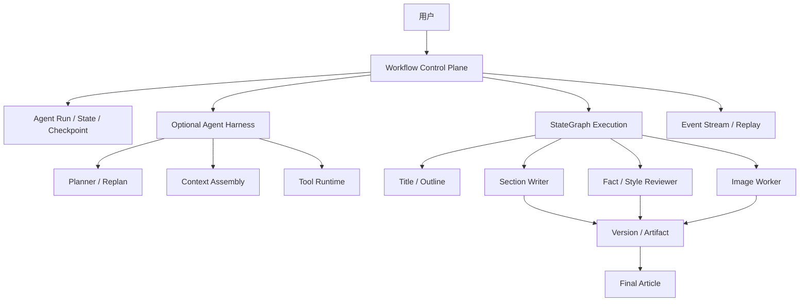

# 简历与面试交付材料

> 目标：让项目在 30 秒内被理解，在 5 分钟内可演示，在面试中能讲清楚取舍。
> 当前定位：求职作品，不是生产认证项目。

## 1. 一句话介绍

Passage Agent 是一个基于 Spring Boot 3.5 和 Spring AI Alibaba 的混合式图文创作系统：

- Workflow 负责状态、审批、Checkpoint、恢复、幂等和副作用边界。
- 受约束 Agent 负责标题、大纲、章节写作、事实/风格评审和局部修订。
- Harness 作为可选的统一门面，提供 Context、Plan/Replan、Tool 和 Workspace 边界。
- 最终交付包括文章、来源、图片、质量报告和可回放运行事件。

## 2. 架构叙事

面试时只讲三条主线：

1. **可靠性**：Run、Checkpoint、恢复互斥、节点幂等和取消优先级。
2. **协作**：章节并行写作、双 Reviewer、有限局部返工和 Artifact 版本。
3. **证据**：H4 staging、Token/延迟代价、恢复成功率，以及为什么暂时不切换默认链路。

## 3. 当前真实状态

| 能力 | 状态 | 说明 |
|---|---|---|
| 标题、大纲、正文、配图主链路 | 默认启用 | 当前用户实际走到的路径 |
| SSE、用户审批、图片降级 | 默认启用 | 已具备端到端业务体验 |
| Run、Checkpoint、恢复、节点幂等 | 默认基础能力 | 支撑故障恢复和副作用一致性 |
| P3 章节质量闭环 | `STAGING` | 已实现，`article.agent.quality-loop.enabled=false` |
| Harness/Plan/Replan/Context/Tool | `STAGING` | 有契约和测试，尚未成为默认主链路 |
| H4 真实模型对比 | 已完成一轮 | 10/10 受控终态，返工和恢复通过 |
| Memory、Context Compression、Sandbox | `DEFER` | 当前不实现 |
| 正式 P5 30 x 3 | `DEFER` | 除非简历需要量化收益 |

## 4. H4 关键证据

最终一轮固定五场景对比：

- 旧 Workflow 与 Harness 均为 5/5 受控终态。
- 旧 Workflow：5 次模型调用、18,065 Token、平均 32.5 秒。
- Harness：24 次模型调用、67,852 Token、平均 107.1 秒。
- Reviewer 返工：1 轮。
- 恢复、人工 Replan、重复副作用检查：全部通过，重复副作用为 0。
- Harness 的功能和恢复链路可用，但延迟与 Token 成本明显更高，且尚未证明同口径质量优势。

因此默认开关继续保持关闭。这个结论本身就是面试中的设计取舍案例。

## 5. 五分钟演示脚本

详细命令见 [demo_runbook.md](demo_runbook.md)。

1. 用确定性 Docker Demo 展示文章、事件、版本和 Artifact 的持久化链路。
2. 用真实模型展示标题、大纲、正文、配图主流程。
3. 打开运行详情面板，展示节点、Checkpoint、事件和 Artifact。
4. 展示 H4 报告，说明 Reviewer 返工、Token 和延迟代价。
5. 用一分钟解释为什么保留旧主链路，不把实验能力伪装成默认能力。

## 6. 面试常见追问

### 为什么不是自由的多 Agent？

因为长任务的审批、恢复、重试和副作用一致性不能交给模型判断。系统采用 Workflow 控制平面，Agent 只负责受约束的认知工作。

### 为什么需要 Checkpoint？

图片、模型和 Tool 都可能失败。Checkpoint 和节点幂等让系统从已确认状态继续，而不是整篇重跑。

### Reviewer 会不会导致质量提升不明显？

会有这种可能。H4 说明增加 Reviewer 后 Token 和延迟显著增加，因此不能只凭“架构更复杂”就宣称效果更好。

### 为什么保留 H4 的负面结论？

因为真实工程判断不是把所有实验都切到默认。证据不足时保持开关关闭，比制造虚假收益数字更可信。

## 7. 简历可用表述

可以直接使用：

- 构建基于 StateGraph 的可恢复图文创作工作流，支持标题/大纲审批、Checkpoint 恢复、取消优先和节点副作用幂等。
- 设计章节级并行写作、Fact/Style 双 Reviewer、质量门禁与最多两轮局部返工，并输出不可变 ArticleVersion 和 Artifact Manifest。
- 建设安全可观测链路，统一记录 Run、Node、Event、模型调用、Token 和恢复信息，支持 SSE 回放和前端运行详情。
- 建立 H4 staging 对比，使用真实 LiteLLM 完成 5 场景 x 2 变体验证，并基于延迟、Token 和返工结果决定继续保持实验开关关闭。

不要使用：

- “已上线多 Agent 质量闭环”。
- “质量提升 X%”，除非完成同口径 legacy/Harness 质量评分。
- “生产级 Memory/Context Compression/Sandbox”。
- 未验证的吞吐、成本或成功率数字。
